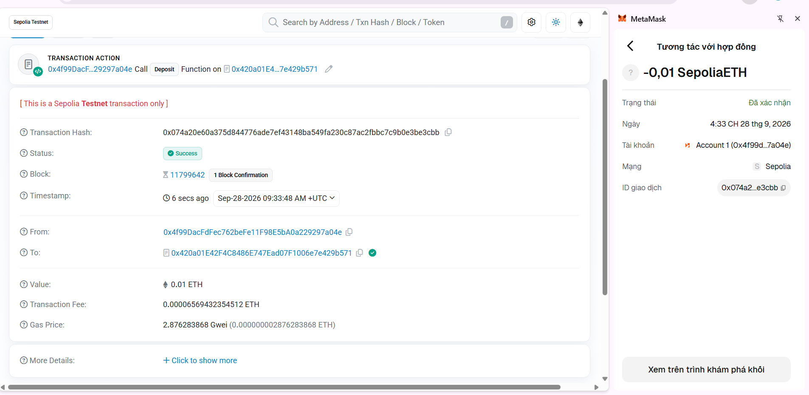
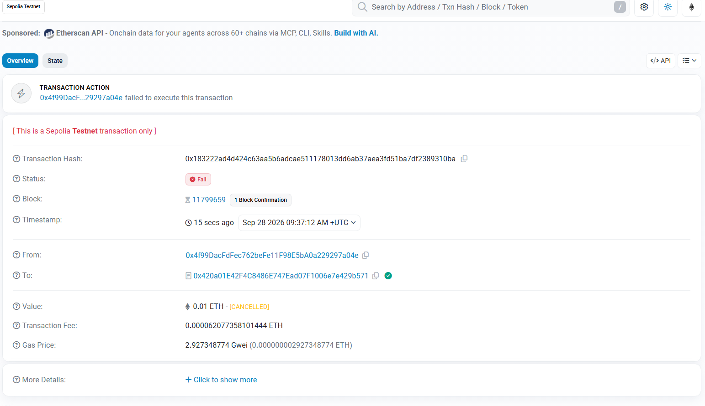
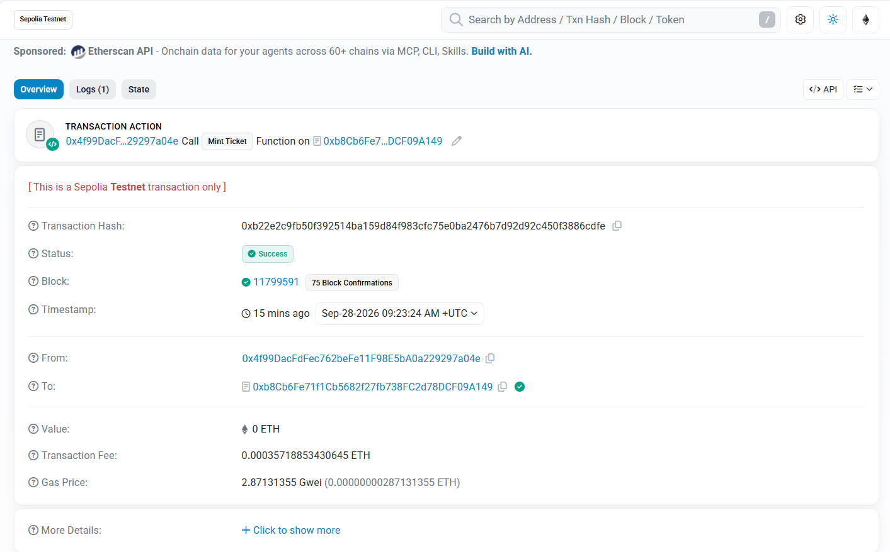
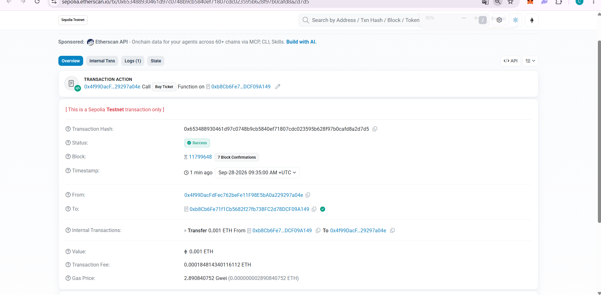
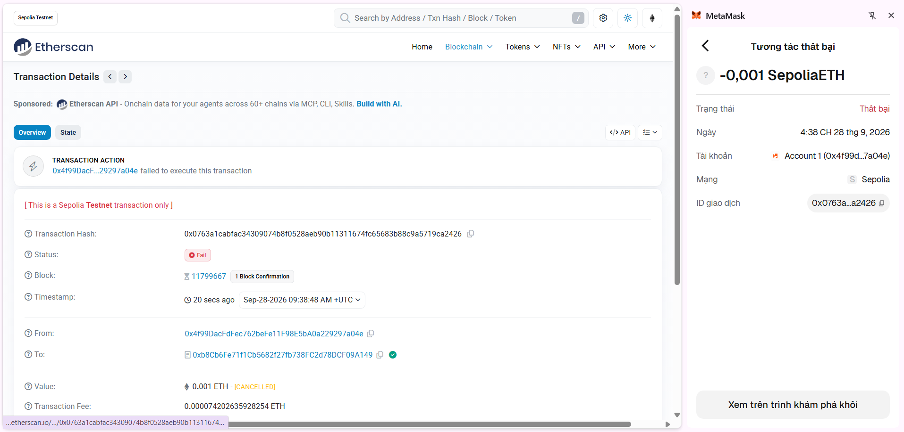

# Bằng chứng thử nghiệm — Lab 9

Lưu ảnh chụp màn hình vào cùng thư mục này (`evidence/lab-09/`) với đúng tên file bên dưới. Ảnh sẽ tự hiển thị khi mở file này trong VS Code (Preview) hoặc trên GitHub.

## TimeLockVault (Remix VM)

### 1. deposit() thành công (nạp 1 ETH)

### 2. withdraw() bị từ chối khi chưa hết khóa — revert StillLocked

### 3. withdraw() thành công sau khi hết thời gian khóa

## ProjectCore (bonus — Sepolia hoặc Remix VM)

### 4. mintTicket() thành công

### 5. buyTicket() thành công (owner đổi chủ)

### 6. buyTicket() lần 2 bị từ chối — revert TicketAlreadySold

